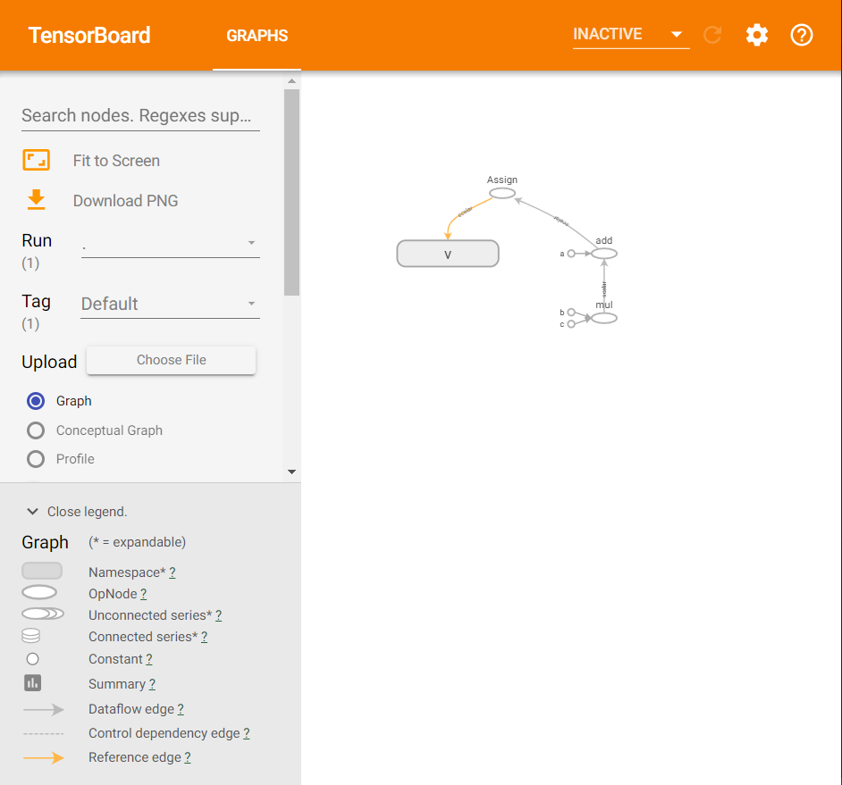

### keras와 tensorflow 설치
```
pip install keras 
pip install tensorflow
```

### Tensorflow
- 대규모 숫자 계산을 해주는 라이브러리
- Tensorflow: 다차원 행렬 계산을 흐르게 한다.  
- [tensorflow.org](https://www.tensorflow.org/)
- [tensorflow.blog](https://tensorflow.blog/)

### anaconda cmd 관리자 버전으로 실행하는 법
- anaconda prompt 우클릭, 관리자권한으로 실행
- env switch하기=> conda activate pyml

### 텐서플로 2.1.0 버전 에러
- module 'tensorflow' has no attribute 'Session'
- 해결: tensorflow 1.15버전을 설치한다(deprecated 된 함수 Session())
```
pip install tensorflow=1.15.0
```

### 합성곱 층(convolution)
- 행렬의 차수를 낮춘다.

### 풀링 층
- 합성곱층으로 얻은 특징맵 C를 축소하는 층
- 특징을 유지한 상태로 축소함
- 최대풀링, 평균풀링(영역을 지정하고 각 영역의 최대값을 , 평균값으로 변환)

### 전결합 층
- 각 층의 유닛을 결합 
- 합성곱층과 풀링층의 결과인 2차원 특징맵을 1차원으로 전개하는 역할
- 활성화 함수 등을 함께 사용해 특징을 더 강조

### 4-4-5_tb_mul.py / 4-4-5_tb_add.py
- 실행하면 지정한 directory에 파일이 생성된다
- anaconda prompt에 들어가서 해당위치(지정한 directory)로 이동하고 
- 명령어 입력한다
```
tensorboard --logdir=./ --port=9999
```
- localhost:9999에 접속한다.
